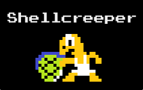
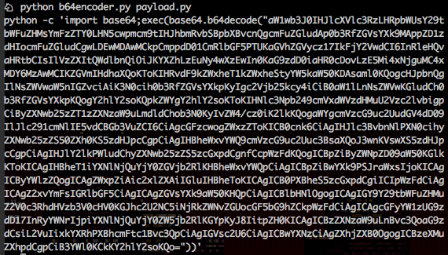
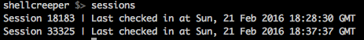
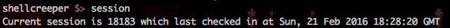
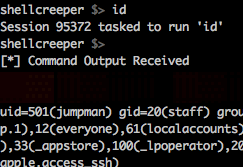

Overview
=========

Shellcreeper is a lightweight asynchronous C2 that communicates over http(s).

### Installation

- Clone Shellcreeper
- ```cd shellcreeper```
- ```npm install```

#### Starting the Shellcreeper server


```
$> ./shellcreeper --port 3000
```

Shellcreeper starts a webserver on port 3000 by default, but you can specify any other port via the --port parameter

You can optionally specify TLS info via ```--key``` ```--cert``` and ```--chain```

#### Preparing your payload

Configure the payload of choice *(see the payloads folder -- currently only python payloads are available)* and give it a valid hostname/ip and port for your shellcreeper server

###### b64encoder.py

Once your payload is configured, you can either run it as is (on your victim) or use the b64encoder script to create a base64 encoded one liner.

```
python b64encoder.py payload.py
```



#### Interacting with your shell

By default your first connection established will be the active shell session. Any command you enter (except for several reserved keywords we'll go over next) will task your current shell to perform an action.

##### Listing active shell sessions
<br>
```sessions``` - Lists all sessions


<br><br>
```session``` - Gets current session



You can change your session by entering ```set session <id>```

#### Tasking your shell

##### Sleep

Once you have an active session, the shell will check in roughly every 10 seconds. You can change the sleep time by entering ```sleep 30``` with 30 being the number of seconds base the randomized sleep time from.

##### Kill

```kill``` will tell the active session to kill itself.

Any other command entered will task the session to execute a system command of that value.


